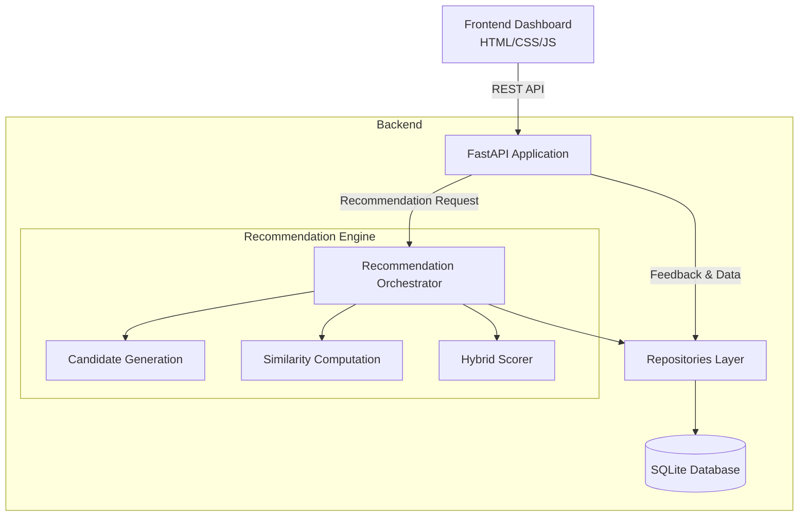
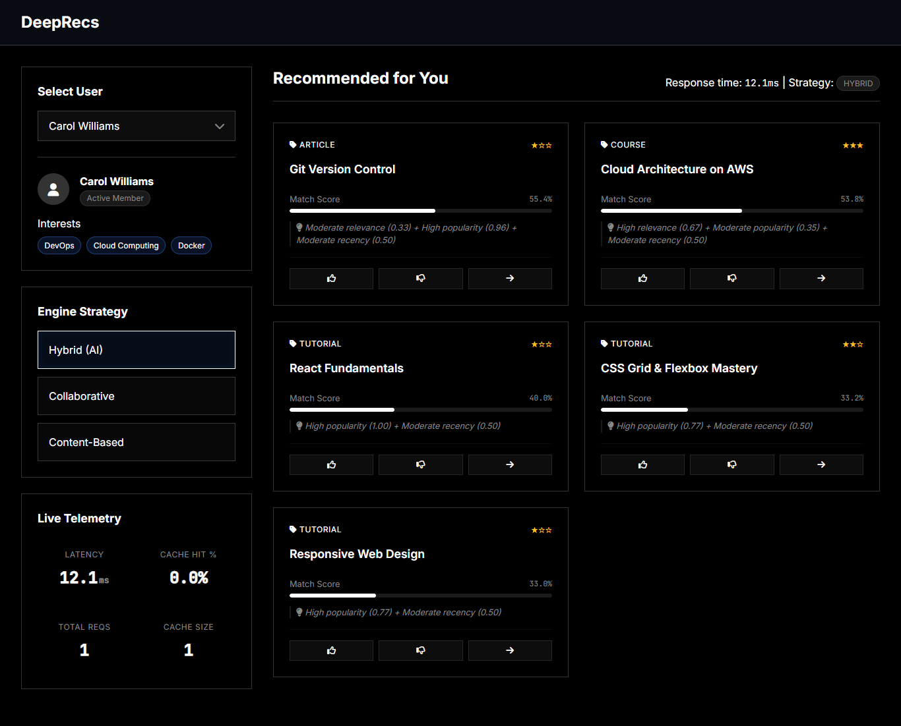

# Complete AI Recommendation System

A production-ready recommendation system built as a full-stack application. It features a SQLite data layer, a pluggable recommendation engine with hybrid scoring, a FastAPI backend, and a modern glassmorphism frontend dashboard.

## Features

- **Hybrid Recommendation Engine**: Combines collaborative filtering, content-based matching, and popularity heuristics.
- **Cold Start Handling**: Recommends personalized popular content for users with no interaction history based on their stated interests.
- **REST API**: Built with FastAPI for high performance, featuring auto-generated Swagger UI docs.
- **Premium Dashboard**: A responsive, dark-mode frontend built with pure HTML/CSS/JS (vanilla) leveraging CSS Grid, Flexbox, and backdrop filters.
- **Telemetry & Metrics**: Built-in request tracing, response time tracking, and caching hit/miss stats.
- **Comprehensive Testing**: Unit tests, integration tests, and simulated concurrent load tests.

## System Architecture



## Screenshots



## Project Structure

```text
day30_capstone/
├── api/
│   ├── __init__.py
│   └── app.py                  # FastAPI Application
├── data/
│   ├── __init__.py
│   ├── database.py             # Database connection
│   ├── models.py               # SQLAlchemy models
│   └── repositories.py         # Data access layer
├── engine/
│   ├── __init__.py
│   ├── candidate_gen.py        # Candidate generation
│   ├── evaluator.py            # System evaluation metrics
│   ├── orchestrator.py         # Main engine entry point
│   ├── scorer.py               # Item scoring
│   └── similarity.py           # Similarity computation
├── frontend/
│   ├── index.html              # Dashboard UI HTML
│   ├── script.js               # Frontend logic
│   └── style.css               # Dashboard styling
├── scripts/
│   ├── evaluate.py             # Evaluation script
│   ├── load_test.py            # Load testing script
│   └── seed_data.py            # Data seeding script
├── tests/
│   ├── __init__.py
│   ├── test_api.py             # API tests
│   ├── test_data.py            # Data layer tests
│   └── test_engine.py          # Engine tests
├── .gitignore                  # Git ignore rules
├── postman_collection.json     # Postman API Collection
├── README.md                   # Project documentation
└── requirements.txt            # Python dependencies
```

## Setup Instructions (Local Environment)

Follow these steps to set up the project locally on your machine:

1. **Create and activate a virtual environment:**
   ```bash
   python -m venv venv
   source venv/Scripts/activate  # Windows
   # or
   source venv/bin/activate      # Mac/Linux
   ```

2. **Install dependencies:**
   ```bash
   pip install -r requirements.txt
   ```

3. **Initialize the database:**
   Seed the database with sample users, content, and interactions.
   ```bash
   python scripts/seed_data.py
   ```

## Running the System Locally

1. **Start the API Server (which also serves the frontend):**
   ```bash
   uvicorn api.app:app --reload
   ```

2. **Open the User Dashboard:**
   Navigate to **http://localhost:8000** in your web browser.

3. **Access the API Documentation:**
   The interactive Swagger UI documentation is available at **http://localhost:8000/docs**.

## API Documentation

The FastAPI backend exposes the following REST endpoints:

- `GET /api/health`
  System health check, verifying database connection and cache size.

- `GET /api/metrics`
  Returns system performance telemetry including total requests, average response time, cache hit ratios, and strategy usage breakdowns.

- `GET /api/users`
  Returns a list of all registered users and their stated interests.

- `GET /api/recommend/{user_id}`
  Fetches personalized content recommendations for a given user.
  - **Query Parameters:**
    - `limit` (int, default: 5): Maximum number of recommendations to return.
    - `strategy` (str, default: 'hybrid'): Recommendation strategy to use ('collaborative', 'content', or 'hybrid').

- `POST /api/feedback`
  Records user interactions asynchronously for future recommendations.
  - **Payload Example:**
    ```json
    {
      "user_id": 1,
      "content_id": "C12",
      "interaction_type": "rate",
      "rating": 5
    }
    ```
  - Valid interaction types: `view`, `click`, `rate`, `complete`.

## Testing & Evaluation

### Running Tests
Execute the unit and integration tests using pytest:
```bash
pytest tests/ -v
```

Run the load test to simulate 10 concurrent users (ensure the API server is running first):
```bash
python scripts/load_test.py
```

### Evaluation Report
To evaluate the performance of the recommendation engine against the seeded dataset, run the evaluation script:
```bash
python scripts/evaluate.py
```

This will generate an `evaluation_report.md` file in the root directory containing:
- **Precision@k**: The proportion of recommended items that are relevant.
- **Recall@k**: The proportion of relevant items that were successfully recommended.
- **NDCG@k**: Normalized Discounted Cumulative Gain, measuring the ranking quality of recommendations.
- **System Telemetry**: Performance metrics recorded during the evaluation run.
